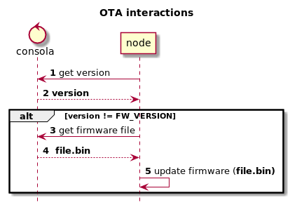

<p align="center">
  <h3 align="center">EasyOta</h3>
  <p align"center">
    The easiest way to implement ota on an esp8266 / esp32 based chip using an HTTP server
  </p>
  <p align="center">
    This is a library that allows you to configure OTA updates in your code without much boilerplate code.
  </p>
</p>
<br>

##### Simple example

Steps to use:

1- Define your configuration object (OTAConfig)

2- Instance the EasyOta object with the configuration created

3- Run runUpdateRoutine() to make the verification process of updates

```c++
#include <EasyOTA.h>
#include <WifiHelper.h>

#define FW_VERSION "1244"

#define OTA_SERVER_URL "http://192.168.0.222:8266"
// This API endpoint must return an integer indicating the version of the server's latest firmware (eg "1244")
#define OTA_GET_VERSION_ENDPOINT "/version" // or /version.php?device=MyDeviceName if using Apache OTA
// This endpoint must return the firmware file
#define OTA_GET_FIRMWARE_ENDPOINT "/firmware" // or /firmware.php?device=MyDeviceName if using Apache OTA
WiFiClient client;

const char *ssid = "TP-LINK_E056F4";
const char *password = "05127238";

OTAConfig config(
        FW_VERSION,
        OTA_SERVER_URL,
        OTA_GET_VERSION_ENDPOINT,
        OTA_GET_FIRMWARE_ENDPOINT,
        true // Debug
);

EasyOTA ota(config);

void setup() {
    Serial.begin(9600);
    Serial.println("Booting");        
    WifiHelper::startWIFI(ssid, password, true, true);
}

void loop() {        
    ota.runUpdateRoutine(client);
    delay(20000); 
}
```

#### Python OTA server example

The following API has two endpoints:

<b>/version</b>:

Returns the version of the latest firmware added in the directory /opt/firmware

The version is obtained by the name of the file removing the extension .bin

Example
If we add a file to the /opt/firmware directory named 1245.bin then the version that would return this endpoint is 1245

<b>/firmware</b>:

Returns the file of the latest firmware added in the directory /opt/firmware


```python

import glob
import os
from bottle import run, static_file, response, get

OTA_GET_VERSION_ENDPOINT = "/version"
OTA_GET_FIRMWARE_ENDPOINT = "/firmware"
OTA_FIRMWARE_DIR = "/opt/firmware"
OTA_SERVER_PORT = 8266
FIRMWARE_FILE_EXTENSION = '.bin'


class OTAServer:
    def __init__(self, port: int, debug_mode: bool = False):
        self.debug_mode = debug_mode
        self.port = port

    def start(self):
        run(host='0.0.0.0', port=self.port, debug=self.debug_mode)

    @staticmethod
    def get_latest_fw_version() -> str:
        """Returns the version of the latest (most recent) firmware file in OTA_FIRMWARE_DIR  dir"""
        list_of_files = glob.glob('{}/*{}'.format(OTA_FIRMWARE_DIR, FIRMWARE_FILE_EXTENSION))
        if not list_of_files:
            return None
        return max(list_of_files, key=os.path.getctime)\
            .replace(FIRMWARE_FILE_EXTENSION, "").replace(OTA_FIRMWARE_DIR+'/', "")

    # ------- ENDPOINTS ------- #

    @staticmethod
    @get(OTA_GET_VERSION_ENDPOINT)
    def get_version() -> str:
        raw_version = OTAServer.get_latest_fw_version()
        if raw_version is None or len(raw_version) == 0:
            response.status = 404
            return ""
        response.status = 200
        return str(raw_version)

    @staticmethod
    @get(OTA_GET_FIRMWARE_ENDPOINT)
    def get_firmware():
        version = OTAServer.get_latest_fw_version()
        if version is None or version == '':
            response.status = 404
            return ""
        return static_file(root=OTA_FIRMWARE_DIR, filename=version + FIRMWARE_FILE_EXTENSION)


if __name__ == '__main__':
    path = pathlib.Path(OTA_FIRMWARE_DIR)
    last_modified = path.stat().st_mtime
    run(host='0.0.0.0', port=OTA_SERVER_PORT, debug=True) 

```
##### Output
<br><br>

 

##### Firmware update sequence
<br><br>
 

#### Apache OTA server example

This API is capable of managing multiple firmware images for different devices.

The following API has two endpoints:

<b>/version.php?device={device}</b>:

Returns the version of the latest firmware for the specified added in the directory /firmware

The version is obtained by the name of the file removing the extension .bin and the device name.

Example
/firmware/MyTemperatureSensor_1245.bin
http://myupdateserver.local/version.php?device=MyTemperatureSensor would return 1245

<b>/firmware.php?device={device}</b>:

Returns the file of the latest firmware for the specified device added in the directory /firmware

<b>version.php</b>
```php

<?php
header("Content-Type:text/html");
include ("functions.php");
if (isset($_GET['device']) && $_GET['device']!="") {
	$device = $_GET['device'];
	echo return_version($device);
}else{
	die("Invalid Request");
	}
?>

```
<b>firmware.php</b>
```php

<?php
header("Content-Type:text/html");
include ("functions.php");
if (isset($_GET['device']) && $_GET['device']!="") {
	$device = $_GET['device'];
	$version = return_version($device);
	$filename =  $device . "_" . $version . ".bin";
	return_file($filename);
}else{
	die("Invalid Request");
	}
?>

```

<b>functions.php</b>
```php

<?php
function return_version($device){
	$allfiles = scandir($_SERVER["DOCUMENT_ROOT"] . "/firmware", SCANDIR_SORT_ASCENDING, null); // for the file format like {device}_{version}.bin
    $devicefiles = array();
    foreach ($allfiles as $string) {
        if (str_contains($string, $device)) {
            $devicefiles[] = str_replace($device."_","",str_replace(".bin","",$string));
        }
    }
    return max($devicefiles);
}

function return_file($filename)
{
	$attachment_location = $_SERVER["DOCUMENT_ROOT"] . "/firmware/" . $filename;
        if (file_exists($attachment_location)) {

            header($_SERVER["SERVER_PROTOCOL"] . " 200 OK");
            header("Cache-Control: public"); // needed for internet explorer
            header("Content-Type: application/octet-stream");
            header("Content-Transfer-Encoding: Binary");
            header("Content-Length:".filesize($attachment_location));
            header("Content-Disposition: attachment; filename=" . $filename);
            readfile($attachment_location);
            die();        
        } else {
            die("Error: File not found.");
        } 
}
?>

```